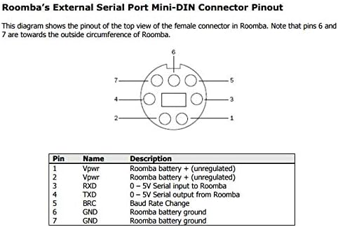
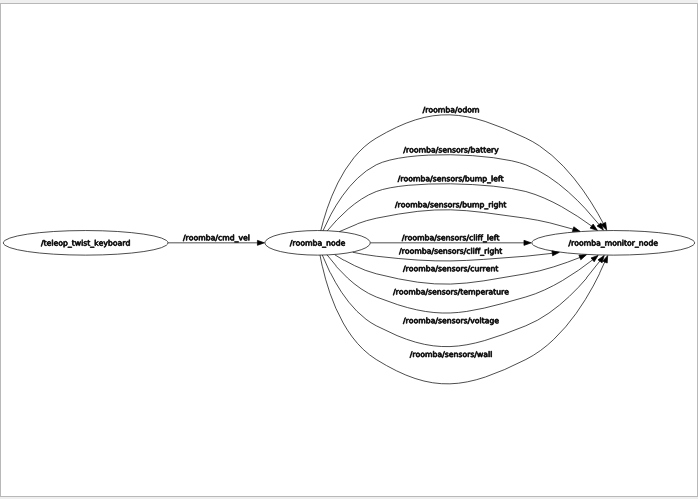
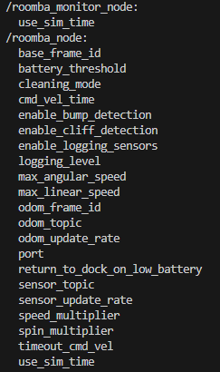
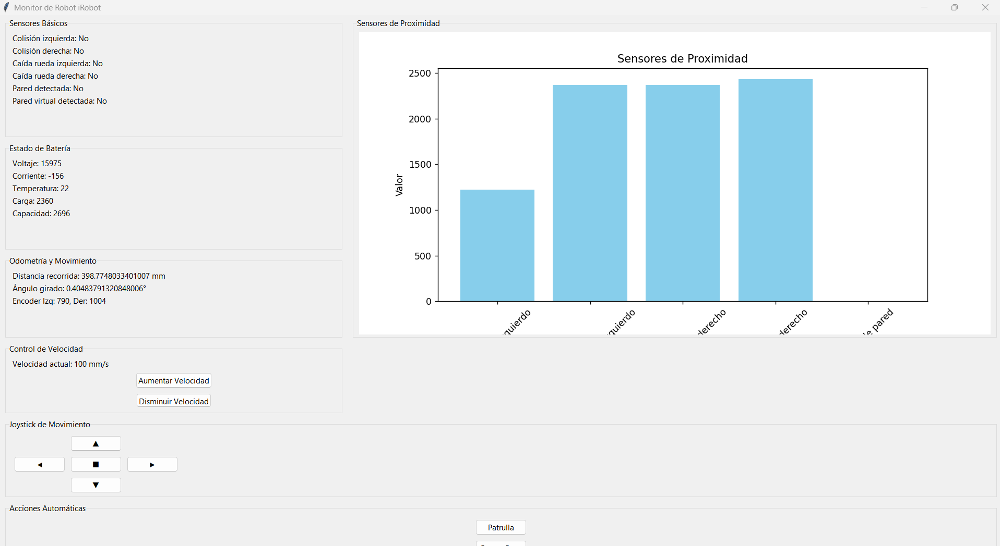
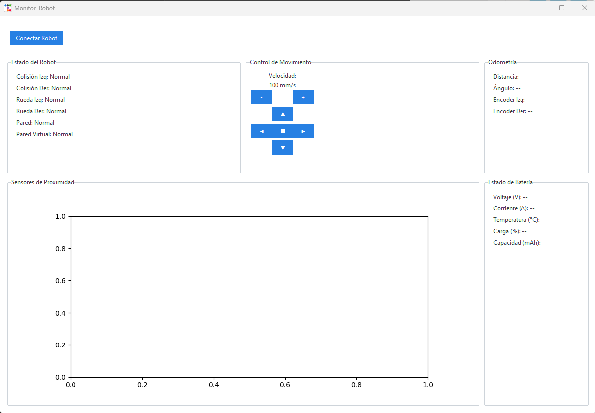
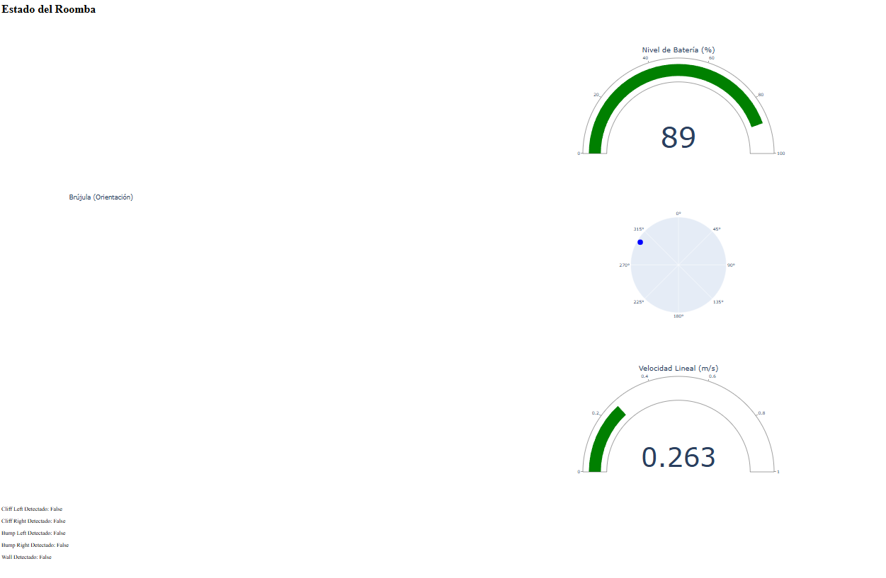
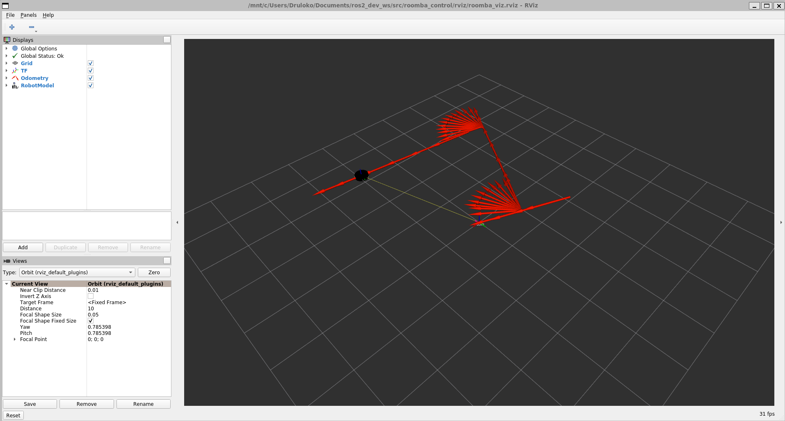

# **Fase 1: Control Básico del Robot Roomba**

## **Descripción General**

La **Fase 1** establece la base fundamental para el desarrollo del proyecto robótico. En esta etapa, se logró implementar una comunicación estable entre un controlador externo y el robot Roomba, utilizando un canal de comunicación basado en puerto serial.

El enfoque principal ha sido desarrollar una aplicación que permita:

- Leer y procesar datos de los sensores del robot.
- Controlar sus actuadores, incluyendo las ruedas, motores de cepillos y vacío.

Esta fase representa el núcleo del sistema, sirviendo como pilar para las fases posteriores, como mapeo, navegación y capacidades de interacción inteligente.

---

## **Objetivos Específicos**

1. **Comunicación Inicial**:

   - Establecer una conexión confiable mediante **puerto serial**, utilizando un cable físico para la comunicación entre el controlador externo y el robot.
  
   

   - Preparar la transición futura hacia comunicación inalámbrica mediante **WiFi** y protocolos **TCP/IP**.

2. **Lectura de Sensores**:

   - Implementar funciones que permitan obtener datos en tiempo real de los sensores integrados, incluyendo:
     - Sensores de colisión, caída y proximidad.
     - Estado de la batería.
     - Encoders para medir el desplazamiento del robot.

3. **Control de Actuadores**:

   - Desarrollar comandos para manejar los componentes del robot, como:
     - Movimiento de las ruedas con velocidad y dirección personalizadas.
     - Activación de los motores de cepillos y vacío.
     - Configuración de LEDs para señales visuales.

4. **Validación del Sistema**:

   - Probar y documentar que los datos de los sensores y los comandos de los actuadores funcionen de manera precisa y confiable.

---

## **Plataforma de Desarrollo**

- **Lenguaje de Programación**: Python, elegido por su flexibilidad y facilidad de integración.
- **Canal de Comunicación**: Puerto serial (conexión física por cable) con migración a WiFi mediante TCP/IP.
- **Sistema Operativo**: Ubuntu, con soporte para herramientas de desarrollo y pruebas.

---

## **Avances Actuales**

### **Control del Robot con ROS 2**

Se ha desarrollado un Nodo ROS 2 que permite:

- Publicar los valores de los sensores del robot, incluyendo odometría y detección de obstáculos.
- Controlar el robot mediante el tópico `cmd_vel`.
- Configuración de parámetros dinámicos para ajustar aspectos como la tasa de publicación, velocidades máximas y tiempo de espera para comandos.





### **Aplicación para Visualización de Sensores**
- Una aplicacion desarrollada en Python permite visualizar en tiempo real los valores de los sensores del robot, tenemos dos versiones.

  

  

- Una aplicación web desarrollada en Python permite visualizar en tiempo real los valores de los sensores del robot, incluyendo:
  - Nivel de batería.
  - Velocidad lineal.
  - Orientación del robot (brújula).
  - Estados de colisión y detección de paredes.

 

### **Simulación en RViz**

Se ha implementado una simulación avanzada del robot en RViz que incluye:

- Un modelo 3D del robot.
- Simulación de sensores en tiempo real.
- Archivo de configuración para iniciar RViz con el modelo y los datos del robot.

 

### **Migración a Comunicación WiFi**

- Implementado un servidor TCP que comparte el puerto serial del robot a través de la red.
- Cliente configurado para crear un puerto serial virtual en el host utilizando la herramienta `socat`.
- Esta solución permite controlar el robot de manera remota.

Ejemplo de configuración:

- **Servidor**:

  ```bash
  python3 lib_server_serialTCP.py
  INFO:SerialTCPServer:Servidor iniciado en 0.0.0.0:5000
  INFO:SerialTCPServer:Esperando conexión del cliente...
  INFO:SerialTCPServer:Cliente conectado desde ('192.168.0.189', 49552)
  ```

- **Cliente**:

  ```bash
  sudo socat -d -d PTY,link=/dev/roomba,raw TCP:192.168.0.167:5000
  ```

---

¡Gracias por tu interés en este proyecto! 🚀\
Contribuciones y sugerencias son bienvenidas.

