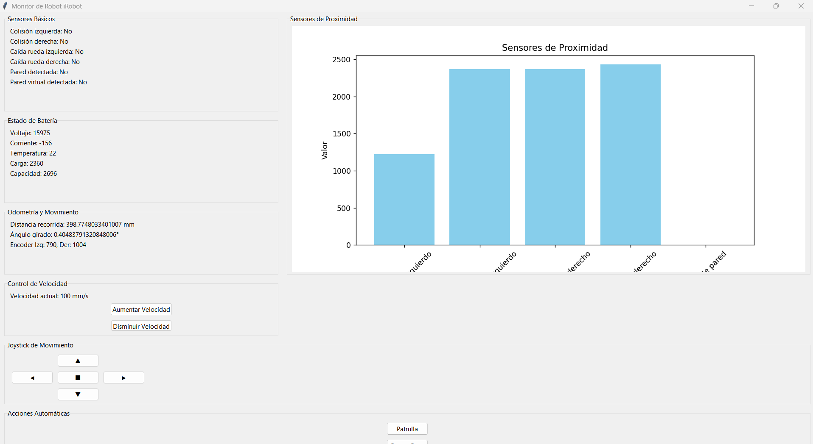

# **Fase 1: Control Básico del Robot Roomba**

## **Descripción General**
La **Fase 1** establece la base fundamental para el desarrollo del proyecto robótico. En esta etapa, se logró implementar una comunicación estable entre un controlador externo y el robot Roomba, utilizando un canal de comunicación basado en puerto serial.

El enfoque principal ha sido desarrollar una aplicación que permita:
- Leer y procesar datos de los sensores del robot.
- Controlar sus actuadores, incluyendo las ruedas, motores de cepillos y vacío.

Esta fase representa el núcleo del sistema, sirviendo como pilar para las fases posteriores, como mapeo, navegación y capacidades de interacción inteligente.

---

## **Objetivos Específicos**
1. **Comunicación Inicial**:
   - Establecer una conexión confiable mediante **puerto serial**, utilizando un cable físico para la comunicación entre el controlador externo y el robot.
   - Preparar la transición futura hacia comunicación inalámbrica mediante **WiFi** y protocolos **TCP/IP**.

2. **Lectura de Sensores**:
   - Implementar funciones que permitan obtener datos en tiempo real de los sensores integrados, incluyendo:
     - Sensores de colisión, caída y proximidad.
     - Estado de la batería.
     - Encoders para medir el desplazamiento del robot.

3. **Control de Actuadores**:
   - Desarrollar comandos para manejar los componentes del robot, como:
     - Movimiento de las ruedas con velocidad y dirección personalizadas.
     - Activación de los motores de cepillos y vacío.
     - Configuración de LEDs para señales visuales.

4. **Validación del Sistema**:
   - Probar y documentar que los datos de los sensores y los comandos de los actuadores funcionen de manera precisa y confiable.

---

## **Plataforma de Desarrollo**
- **Lenguaje de Programación**: Python, elegido por su flexibilidad y facilidad de integración.
- **Canal de Comunicación**: Puerto serial (conexión física por cable) con planes futuros de migración a WiFi y TCP/IP.
- **Sistema Operativo**: Ubuntu, con soporte para herramientas de desarrollo y pruebas.

---

## **Resultados Finales Esperados**

1. Comunicación estable entre el robot y el controlador externo.
2. Lectura precisa de datos en tiempo real desde los sensores del robot.
3. Control completo de los actuadores, asegurando la capacidad de mover el robot y manejar sus componentes integrados.
4. Una aplicación base funcional que sirva como fundamento para las fases avanzadas del proyecto.

---

## **Estado Actual**
- El desarrollo de la **Fase 1** está **completo**.
- Se ha implementado una aplicación en Python que:
  - Establece comunicación confiable con el robot a través de un puerto serial.
  - Lee y procesa datos de los sensores, incluyendo detección de colisiones, estado de la batería y medición de distancias.
  - Controla los actuadores del robot, como motores de ruedas y cepillos.
- Esta aplicación constituye la base principal del proyecto y habilita la transición hacia fases más complejas como mapeo y navegación autónoma.

---

## **Próximos Pasos**
- Migrar el canal de comunicación a **WiFi** utilizando **TCP/IP**.
- Iniciar la Fase 2: **Mapeo del Entorno**, integrando sensores LiDAR y Kinect para construir mapas 2D y 3D del espacio.

---

¡Gracias por tu interés en este proyecto! 🚀  
Contribuciones y sugerencias son bienvenidas.
